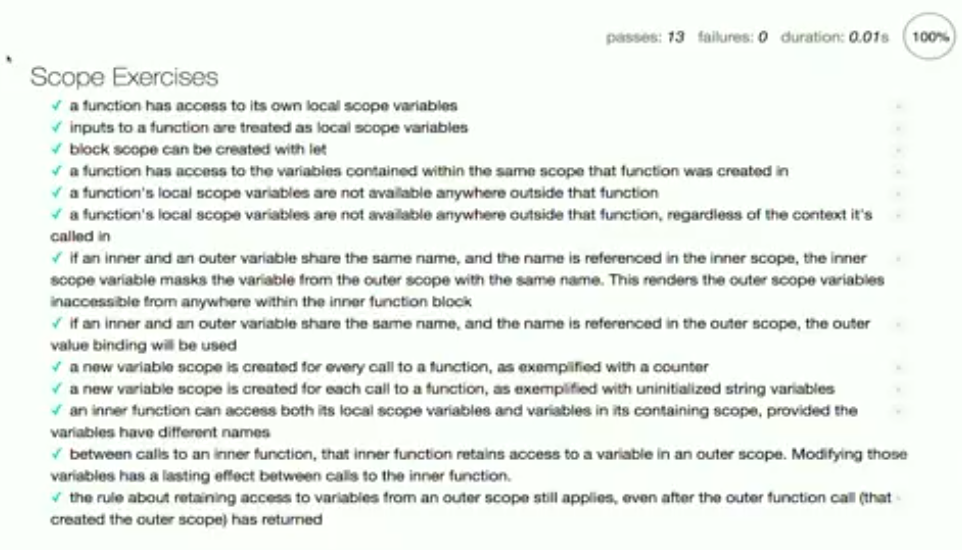

Intro
=====
Functional programming is about verbs
Object oriented programming is about nouns

Data Structures
===============

Objects
------

    var person = {};
    person.name = "Mrs. White";

    var person = {
        "name": "Mrs. White"
    };

Functions
=========

Arrow Functions
---------------
* Binds context to its parent context
* It doesn't own its own keyword this
* Doesn't have its own value for the arguments keyword

Arguments
---------
function(a, b, c, ...d);
d => is all leftover args
keyword: `arguments` is all values passed into function

Scope
=====
Area where you can access a variable
not using `var` or using `window.foo` is a global variable

Callbacks
=========

Functional Utilities
====================

Advanced Scope: Closure
=======================

Summary
=======
